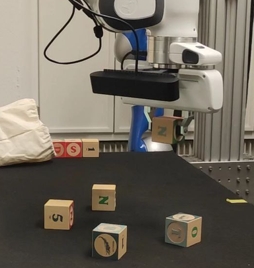
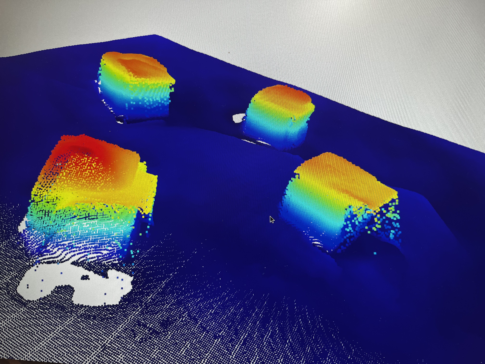
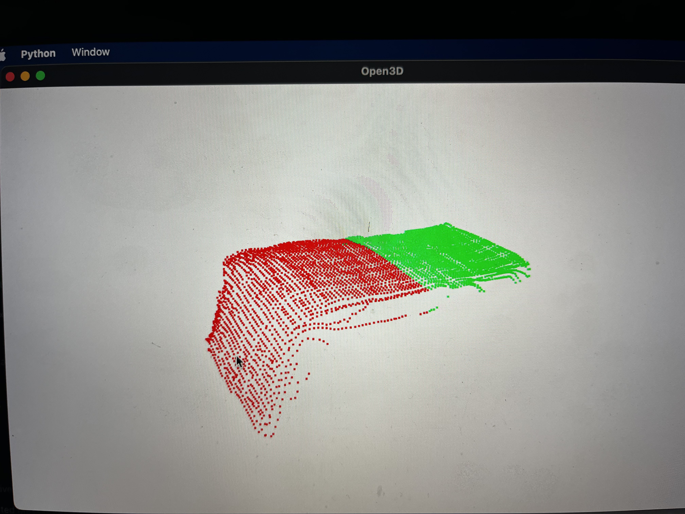
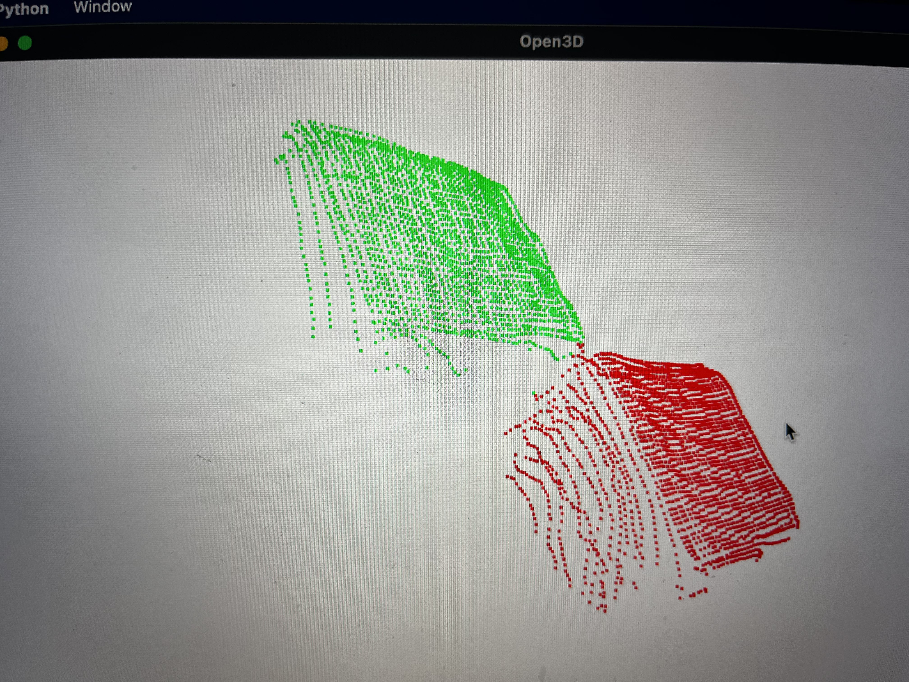
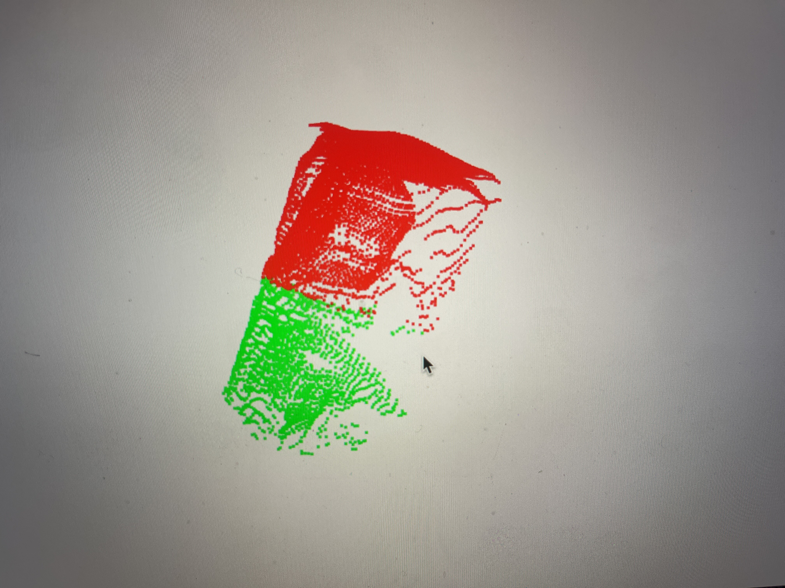
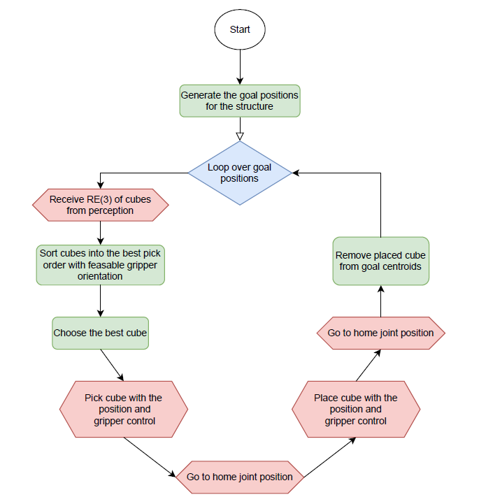
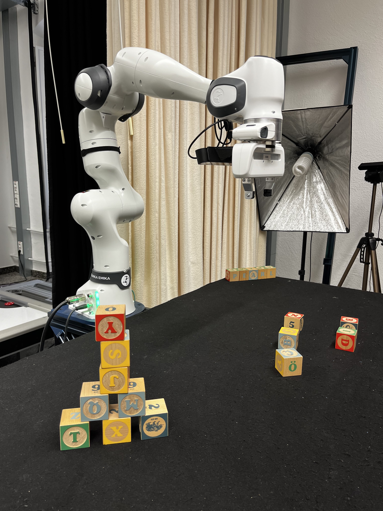
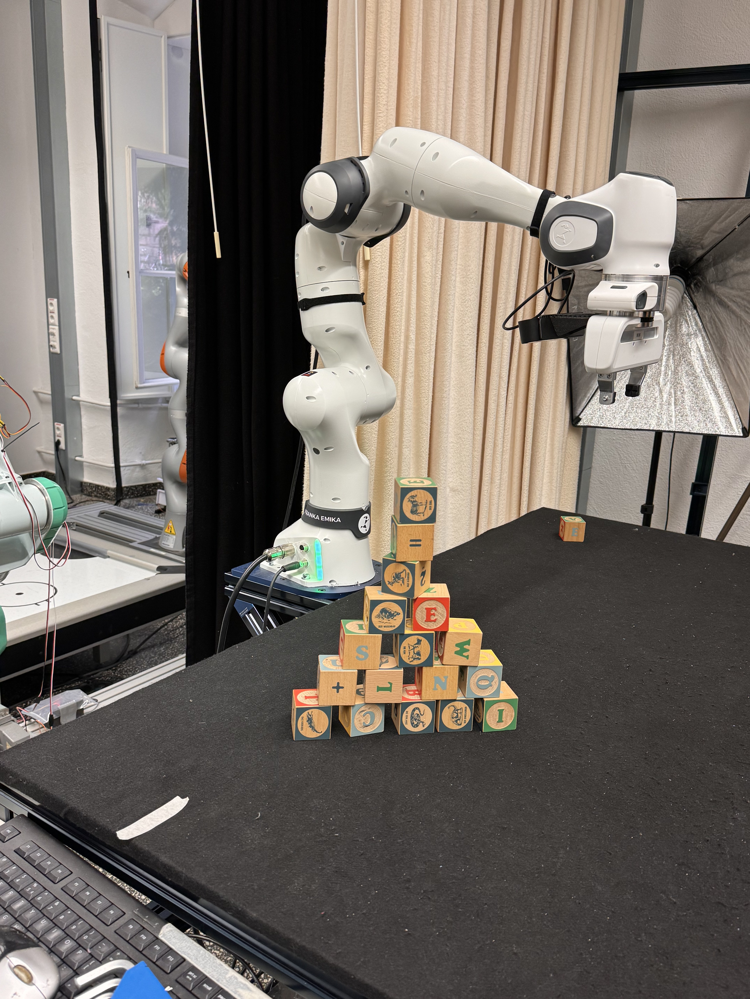

# ProjectLab IRM Final Report

This repository contains the code and documentation for the ProjectLab IRM project. The project focuses on building a tower and a pyramid with cubes using a robotic arm in a simulated and real environment. The project leverages ROS, MoveIt, and perception algorithms to accomplish the tasks.

## Table of Contents

- [Problem](#problem)
- [Methods](#methods)
  - [Perception](#perception)
    - [Issues](#issues)
    - [Pipeline](#pipeline)
  - [Control](#control)
- [Task Scheduler](#task-scheduler)
- [Results](#results)
- [Future Work](#future-work)
- [Appendix](#appendix)

## Problem

The primary goal of this project was to build a tower with cubes using a robotic arm. A Docker image with an installed ROS workspace was provided, which included packages for a Gazebo simulation environment, a script to spawn cubes, and a camera for receiving point cloud or RGB images. The project was divided into two main parts: perception and control.

  
  
<em>Figure 1: A simple starting environment which could be used to build a structure.</em>

The secondary goal was to extend the infrastructure to build a pyramid out of cubes. The perception group focused on refining the cube detection, while the control group handled error management within movements.

## Methods

### Perception

Perception is about enabling the robot to "see" and make sense of its surroundings using sensors and cameras. The following methods and technologies were used to achieve this:

#### Issues

- **Point Cloud Complexity:** Handling dense and unstructured point clouds was challenging, impacting the efficiency of data processing and object detection.
- **Transformation from Camera to Base Frame:** Difficulties in transforming point cloud data accurately from the camera's coordinate frame to the robot's base coordinate frame.
- **Camera Parameters Adjustment:** Transitioning from 720p to 2K resolution with neural network preprocessing for better accuracy required extensive experimentation.

  
  
<em>Figure 2: Combined point clouds distortion </em>

#### Pipeline

1. **Scanning and Saving Point Clouds:** The robot scans the environment from predetermined positions, transforming and saving point clouds for further processing.
2. **Preprocessing and Region of Interest:** Point clouds are converted into NumPy arrays, and regions of interest are isolated for cube detection.
3. **Outlier Removal:** Outliers are removed using a nearest neighbors approach.
4. **Desk Removal:** Desk is filtered out by removing values below a certain height threshold.
5. **Segmentation with DBScan:** Point clouds are segmented to identify individual cubes.
6. **KMeans clustering**: to detect cluttered cubes 
7. **Model Alignment and ICP:** Cubes are modeled and aligned using the Iterative Closest Point (ICP) algorithm.
8. **Final Transformation:** The position and orientation of each cube are determined for accurate placement.

  <table>
    <tr>
      <td></td>
      <td></td>
      <td></td>
    </tr>
    <tr>
      <td><em>Figure 3a: Parallel Cubes</em></td>
      <td><em>Figure 3b: Diagonal Cubes</em></td>
      <td><em>Figure 3c: Stacked Cubes</em></td>
    </tr>
  </table>
  
<em>Figure 3: KMeans Clustering of cubes </em>

### Control

Control involves moving the robot to specific positions and using the gripper for manipulation tasks. The functionalities include:

- **Basic Controls:** Moving to positions, using the gripper for opening, closing, and grasping.
- **Higher-Level Functions:** Arc movement for scene perception and grasp generation for picking cubes.
- **Task Integration:** Combining control and perception to pick and place cubes efficiently.

## Task Scheduler

The task scheduler combines the control and perception components to build structures. It generates goal positions for cubes and ensures the structure is completed by picking and placing cubes in an optimal order. The scheduler handles the overall workflow, including re-scanning for cubes and sorting them for best pickable order.

  
  
<em>Figure 4: The flowchart shows the structure of the task scheduler which is used to combine perception and control to build a structure. In this chart, the squared, green nodes are for parts that are handled by the scheduler, the diamond-shaped, blue node represents a loop while the red hexagons are for service calls to the control or perception packages. </em>

## Results

The project successfully built a tower of five cubes and a pyramid of seven cubes. The infrastructure can build various structures depending on the cube arrangements. However, limitations such as position estimation errors and missing collision detection were encountered.

  <table>
    <tr>
      <td></td>
      <td></td>
    </tr>
  </table>
  
<em>Figure 5: The figures show the structures which were built during the final demonstration. The left figure is the first try and shows a smaller pyramid with a tower of two on top. The right figure shows a pyramid of five with a tower of two on top. Both were built by providing new cubes during the demonstration </em>

## Future Work

- **Perception:** Efficiently combine point clouds and include RGB images for better cube detection and orientation.
- **Control:** Create planning scenes to avoid obstacles, update cube positions, and improve grasp generation for cluttered scenes.

